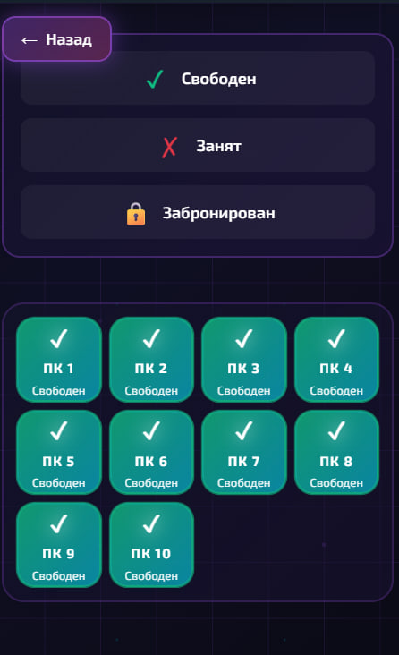
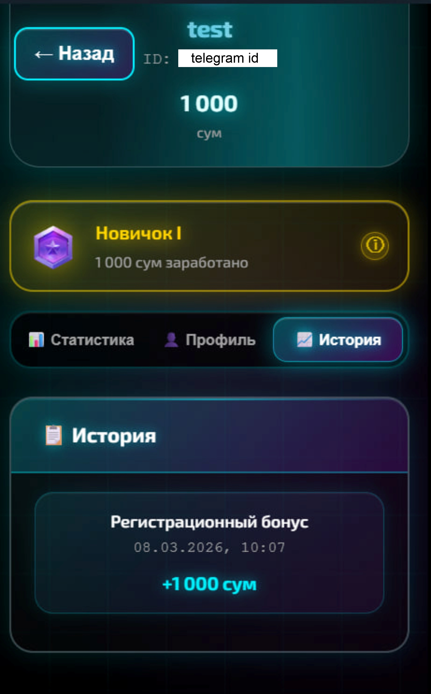

# Dkx Game Club OS/Manager

Open-source Telegram-first platform for gaming club operations, player engagement, and AI-assisted analytics. The project combines a PHP backend, SQLite storage, Telegram bot/webhook flows, a customer-facing WebApp, and an admin panel for bookings, points, tasks, referrals, ranks, daily rewards, and operational statistics.

## Why this repository exists

This repository is the public OSS version of the club management platform previously used in production under a private brand/domain. It has been prepared for publication by:

- moving secrets to `.env`
- adding `.env.example`
- documenting installation and architecture
- formalizing PHP and Node dependencies
- separating local runtime artifacts from source control

## Core features

- Telegram WebApp entrypoint with request validation
- Booking flow for gaming PCs
- Admin interface for computers, bookings, users, tasks, points, and statistics
- Loyalty points, user ranks, daily rewards, tap-to-earn bonuses, referrals, and notifications
- Task-based engagement flows such as social actions and promotional activities
- AI-oriented analytics for user behavior, booking trends, visitor peaks, and operational recommendations
- Email verification flow via SMTP + PHPMailer
- Russian / Uzbek UI split via `/` and `/uz`
- SQLite-based storage for quick local setup

## Product overview

Dkx Game Club OS/Manager is designed as an open-source operating system for gaming clubs that want both operational tooling and player retention mechanics in one place.

On the player side, the system provides a Telegram-connected WebApp where users can book PCs, register profiles, accumulate loyalty points, unlock higher ranks based on total progress, claim daily bonuses, use a tap-to-earn mechanic with a capped daily reward, complete engagement tasks such as subscribing to social channels, and invite friends through referral links to earn additional rewards.

On the operations side, administrators can manage PC statuses, review bookings, track users, assign tasks, adjust balances, and monitor activity through a Telegram-connected admin interface. The platform also includes an AI-oriented analytics layer focused on practical decision support: analyzing user behavior, identifying which halls and individual PCs are booked most often, detecting which days bring the highest visitor traffic, and producing suggestions that help improve retention, utilization, and overall club performance.

## Tech stack

- PHP 8.1+ for backend endpoints and Telegram webhook handling
- SQLite for local persistence
- PHPMailer for SMTP email delivery
- HTML, CSS, and vanilla JavaScript for the frontend
- Optional Node.js utility for local database bootstrap
- Apache `.htaccess` rules for production hosting

## Repository layout

```text
.
├── api.php                # Main JSON API
├── index.php              # Telegram bot webhook + main web entry
├── admin.html             # Admin interface
├── booking.html           # Booking page
├── points.html            # Rewards/points page
├── profile.html           # User profile page
├── config.php             # Shared runtime configuration loader
├── database.js            # Optional Node bootstrap helper
├── database/
│   └── schema.sql         # SQLite schema reference
├── docs/
│   ├── architecture.md
│   ├── installation.md
│   └── ai-module.md
├── screenshots/           # Product and interface screenshots
├── composer.json          # PHP dependency manifest
├── package.json           # Optional Node utility manifest
├── CHANGELOG.md
└── ROADMAP
```

## Quick start

1. Install PHP dependencies:

```bash
composer install
```

2. Copy environment variables:

```bash
cp .env.example .env
```

3. Fill in Telegram, SMTP, and deployment values in `.env`.

4. Create the SQLite database:

```bash
npm install
npm run db:init
```

5. Run on a local PHP server:

```bash
php -S localhost:8000
```

6. Open `http://localhost:8000/`.

## Configuration

The public repository does not ship production secrets. Required variables are documented in `.env.example`.

Important values:

- `APP_NAME`: repository/project title, default `Dkx Game Club OS/Manager`
- `APP_SHORT_NAME`: short UI label, default `DKX Game Club`
- `APP_URL`: base deployment URL
- `WEBHOOK_URL`: Telegram webhook target
- `BOT_TOKEN`: Telegram bot token
- `ADMIN_IDS`: comma-separated Telegram admin IDs
- `GROUP_ID`: Telegram group/channel identifier
- `DB_NAME`: SQLite file name
- `SMTP_*`: email delivery settings

## Dependencies

PHP dependencies are managed through [composer.json](composer.json).

- `phpmailer/phpmailer`

Node dependencies are managed through [package.json](package.json).

- `better-sqlite3`

## Security and publication notes

- Do not commit `.env`, `*.db`, log files, or local diagnostics.
- Review `.htaccess` before production deployment.
- Replace example URLs/domains with your own deployment host.
- Rotate any old secrets that were ever used outside this sanitized OSS setup.

## Documentation

- [Architecture](docs/architecture.md)
- [Installation](docs/installation.md)
- [AI Module Notes](docs/ai-module.md)
- [Changelog](CHANGELOG.md)
- [Roadmap](ROADMAP)

## Screenshots

### Bot and onboarding


### Main WebApp


### Booking and profile







### Content pages


## License

Released under the MIT License. See [LICENSE](LICENSE).
