<div align="center">

# Game Club OS/Manager


<p>
  
  
  
  
  
  
  
  
  
</p>

<p>
  <a href="#quick-start"><strong>Quick Start</strong></a> •
  <a href="#repository-layout"><strong>Repository Layout</strong></a> •
  <a href="#ai-analytics-module"><strong>AI Module</strong></a> •
  <a href="#screenshots"><strong>Screenshots</strong></a> •
  <a href="#documentation"><strong>Docs</strong></a>
</p>

</div>

> Open-source Telegram-first platform for gaming club operations, player engagement, and AI-assisted analytics.

Dkx Game Club OS/Manager combines a PHP backend, SQLite storage, Telegram bot and webhook flows, a customer-facing WebApp, and an admin panel for bookings, rewards, ranks, daily bonuses, referrals, tasks, notifications, and operational statistics.

It is built for gaming clubs that need more than a simple booking page. The project connects daily operations, retention mechanics, and decision-support analytics into one extensible open-source system.

## Why this repository exists

This repository is the public OSS version of a club management platform that was previously used under a private brand/domain. It was prepared for open-source publication by moving secrets to `.env`, documenting installation and architecture, formalizing dependencies, and separating runtime artifacts from source control.

## Highlights

<table>
  <tr>
    <td width="33%" valign="top">
      <h3>🎮 Player WebApp</h3>
      <p>Telegram-connected booking flow with profile, rewards, referral links, daily bonuses, and rank progression.</p>
    </td>
    <td width="33%" valign="top">
      <h3>🛠️ Admin Control</h3>
      <p>Real-time management for PCs, bookings, users, tasks, balances, and operating statistics.</p>
    </td>
    <td width="33%" valign="top">
      <h3>🤖 AI Analytics</h3>
      <p>Structured analytics pipeline for hall demand, top PCs, traffic peaks, and actionable improvement ideas.</p>
    </td>
  </tr>
  <tr>
    <td width="33%" valign="top">
      <h3>🏆 Retention Loops</h3>
      <p>Points, ranks, tap-to-earn, daily claims, referral rewards, and task-based engagement flows.</p>
    </td>
    <td width="33%" valign="top">
      <h3>🌍 Localization</h3>
      <p>Russian, Uzbek, and English user-facing support with Telegram-aware language handling.</p>
    </td>
    <td width="33%" valign="top">
      <h3>🔓 OSS-Ready</h3>
      <p>MIT license, docs, changelog, roadmap, screenshots, templates, and contributor-facing repository health files.</p>
    </td>
  </tr>
</table>

## Why it matters

Most gaming club software solves only one narrow layer of the business: bookings, CRM, or messaging. Dkx Game Club OS/Manager connects these layers inside a Telegram-first workflow that players already use. The result is a system that helps clubs manage computers and bookings, keep users returning through rewards and progression, and understand real usage patterns through analytics instead of guesswork.

## Core capabilities

- Telegram WebApp entrypoint with request validation
- Booking flow for gaming PCs
- Admin interface for computers, bookings, users, tasks, points, and statistics
- Loyalty points, user ranks, daily rewards, tap-to-earn bonuses, referrals, and notifications
- Task-based engagement flows such as social actions and promotional activities
- AI-oriented analytics for user behavior, booking trends, visitor peaks, and operational recommendations
- Email verification flow via SMTP + PHPMailer
- Russian, Uzbek, and English support for the player-facing experience
- SQLite-based storage for quick local setup

## Product overview

Dkx Game Club OS/Manager is designed as an open-source operating system for gaming clubs that want both operational tooling and player retention mechanics in one place.

On the player side, the system provides a Telegram-connected WebApp where users can book PCs, register profiles, accumulate loyalty points, unlock higher ranks based on total progress, claim daily bonuses, use a tap-to-earn mechanic with a capped daily reward, complete engagement tasks such as subscribing to social channels, and invite friends through referral links to earn additional rewards.

On the operations side, administrators can manage PC statuses, review bookings, track users, assign tasks, adjust balances, and monitor activity through a Telegram-connected admin interface. The platform also includes an AI-oriented analytics layer focused on practical decision support: analyzing user behavior, identifying which halls and individual PCs are booked most often, detecting which days bring the highest visitor traffic, and producing suggestions that help improve retention, utilization, and overall club performance.

This makes the project useful both as a deployable tool and as an open-source foundation. Clubs can adapt it to local workflows, while contributors can extend clear areas such as booking rules, gamified retention logic, analytics prompts, admin tooling, or localization support.

## Tech stack

<p>
  
  
  
  
  
  
</p>

- PHP 8.1+ for backend endpoints and Telegram webhook handling
- SQLite for local persistence
- PHPMailer for SMTP email delivery
- HTML, CSS, and vanilla JavaScript for the frontend
- Optional Node.js utility for local database bootstrap
- Apache `.htaccess` rules for production hosting

## Repository layout

```text
.
├── api.php                # Main JSON API
├── index.php              # Telegram bot webhook + main web entry
├── admin.html             # Admin interface
├── booking.html           # Booking page
├── points.html            # Rewards/points page
├── profile.html           # User profile page
├── config.php             # Shared runtime configuration loader
├── ai/
│   ├── ClubAnalyticsLight.php
│   └── analyze.php        # Lightweight AI analytics entrypoint
├── database.js            # Optional Node bootstrap helper
├── database/
│   └── schema.sql         # SQLite schema reference
├── docs/
│   ├── architecture.md
│   ├── installation.md
│   └── ai-module.md
├── screenshots/           # Product and interface screenshots
├── composer.json          # PHP dependency manifest
├── package.json           # Optional Node utility manifest
├── CHANGELOG.md
└── ROADMAP
```

## Quick start

1. Install PHP dependencies:

```bash
composer install
```

2. Copy environment variables:

```bash
cp .env.example .env
```

3. Fill in Telegram, SMTP, and deployment values in `.env`.

4. Create the SQLite database:

```bash
npm install
npm run db:init
```

5. Run on a local PHP server:

```bash
php -S localhost:8000
```

6. Open `http://localhost:8000/`.

## Configuration

The public repository does not ship production secrets. Required variables are documented in `.env.example`.

Important values:

- `APP_NAME`: repository/project title, default `Dkx Game Club OS/Manager`
- `APP_SHORT_NAME`: short UI label, default `DKX Game Club`
- `APP_URL`: base deployment URL
- `WEBHOOK_URL`: Telegram webhook target
- `BOT_TOKEN`: Telegram bot token
- `ADMIN_IDS`: comma-separated Telegram admin IDs
- `GROUP_ID`: Telegram group/channel identifier
- `DB_NAME`: SQLite file name
- `SMTP_*`: email delivery settings
- `OPENAI_API_KEY`: API key for the analytics module
- `OPENAI_MODEL`: model name for analytics requests, default `gpt-5.4`

## Dependencies

PHP dependencies are managed through [composer.json](composer.json).

- `phpmailer/phpmailer`

Node dependencies are managed through [package.json](package.json).

- `better-sqlite3`

## Security and publication notes

- Do not commit `.env`, `*.db`, log files, or local diagnostics.
- Review `.htaccess` before production deployment.
- Replace example URLs/domains with your own deployment host.
- Rotate any old secrets that were ever used outside this sanitized OSS setup.

## Documentation

- [Architecture](docs/architecture.md)
- [Installation](docs/installation.md)
- [AI Module Notes](docs/ai-module.md)
- [Changelog](CHANGELOG.md)
- [Roadmap](ROADMAP)

## Contribution areas

Useful contribution directions include:

- improving booking rules, hall logic, or workstation management flows
- extending loyalty mechanics such as ranks, daily bonuses, referrals, and task rewards
- refining admin tooling and operational dashboards
- expanding analytics prompts, reporting structure, and data coverage
- hardening deployment, installation, and documentation for wider OSS adoption

## AI analytics module

The repository includes a lightweight analytics module that reads the SQLite database, aggregates club metrics, and can send them to the OpenAI API for a structured report.

Its purpose is to turn raw club activity into actionable signals for administrators. Even in the lightweight version, the module is aimed at questions that matter operationally: which halls and PCs attract the most bookings, when traffic is highest, how engagement systems are being used, and which improvements could increase retention or workstation utilization.

Metrics-only mode:

```bash
php ai/analyze.php --metrics-only
```

Full AI analysis:

```bash
php ai/analyze.php
```

Optional flags:

- `--db=club.db` to point to another SQLite file
- `--json` to print JSON instead of a console report
- `--save=reports/latest.txt` to write the output to a file

Current lightweight coverage includes:

- user counts, registrations, and points balances
- booking volumes, hall demand, top PCs, and busiest weekdays
- task completion activity
- referral and reward usage
- points economy and rank distribution

## Screenshots

<table>
  <tr>
    <td align="center" width="33%">
      <a href="screenshots/bot-start.jpg"></a>
      <br />
      <strong>Bot Start</strong>
    </td>
    <td align="center" width="33%">
      <a href="screenshots/preloader-screen.jpg">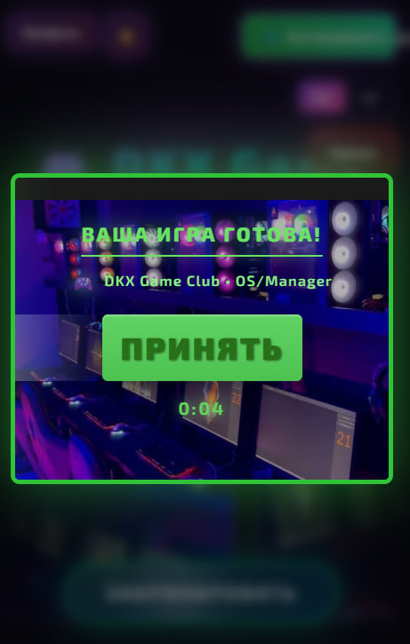</a>
      <br />
      <strong>Preloader</strong>
    </td>
    <td align="center" width="33%">
      <a href="screenshots/registration-flow.jpg">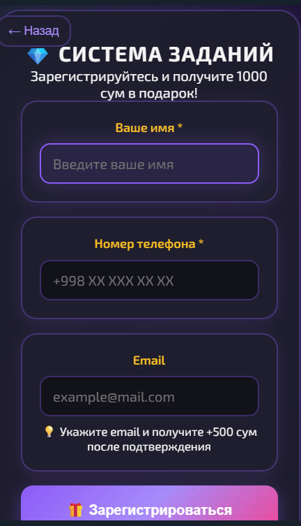</a>
      <br />
      <strong>Registration Flow</strong>
    </td>
  </tr>
  <tr>
    <td align="center" width="33%">
      <a href="screenshots/main-homepage.jpg">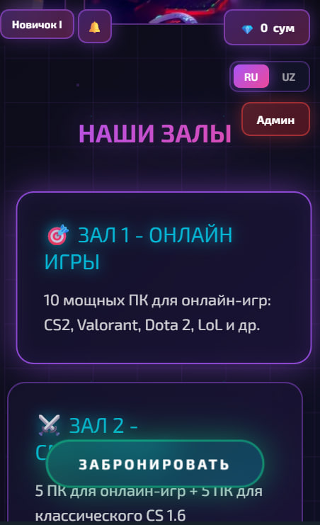</a>
      <br />
      <strong>Main Homepage</strong>
    </td>
    <td align="center" width="33%">
      <a href="screenshots/main-homepage-secondary.jpg">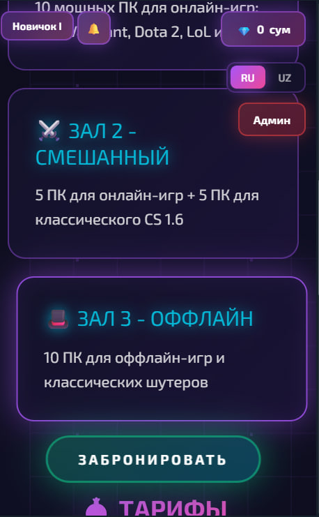</a>
      <br />
      <strong>Homepage Secondary</strong>
    </td>
    <td align="center" width="33%">
      <a href="screenshots/main-homepage-ranking.jpg">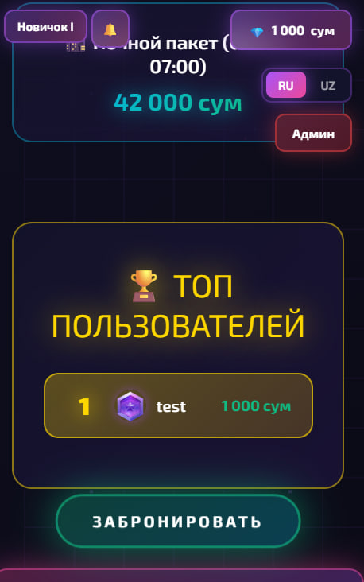</a>
      <br />
      <strong>Rankings View</strong>
    </td>
  </tr>
  <tr>
    <td align="center" width="33%">
      <a href="screenshots/booking-page.jpg">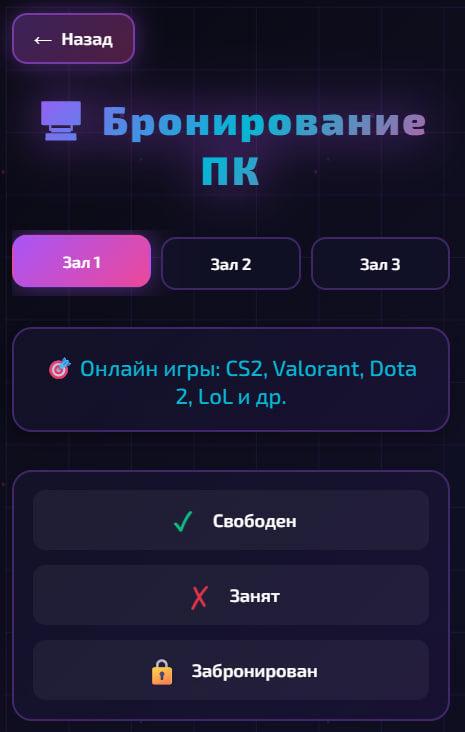</a>
      <br />
      <strong>Booking</strong>
    </td>
    <td align="center" width="33%">
      <a href="screenshots/profile-page.jpg">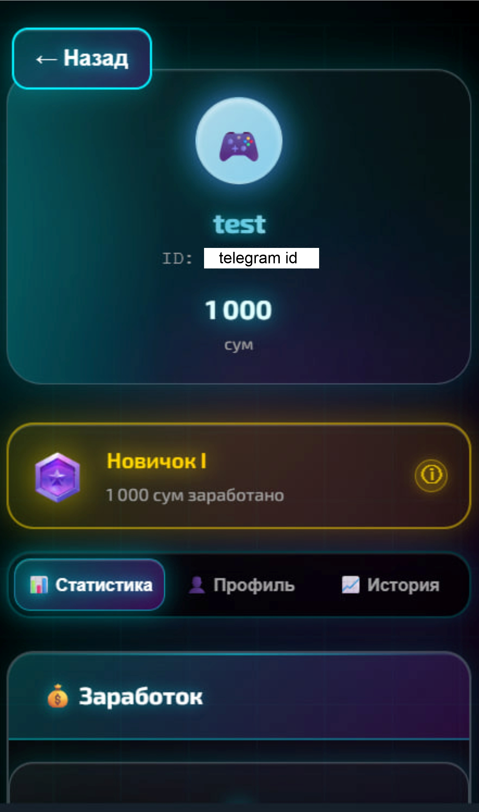</a>
      <br />
      <strong>Profile</strong>
    </td>
    <td align="center" width="33%">
      <a href="screenshots/profile-statistics.jpg">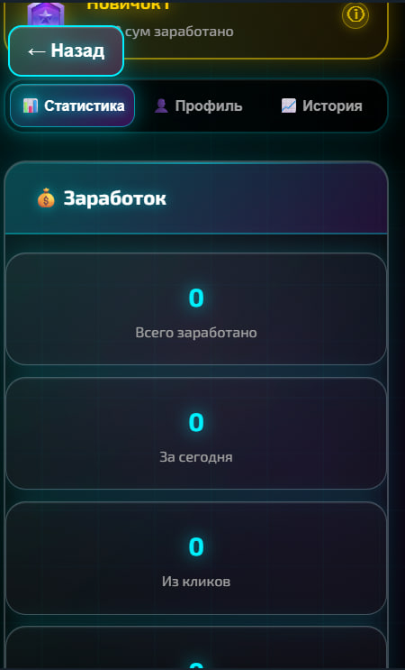</a>
      <br />
      <strong>Player Statistics</strong>
    </td>
  </tr>
  <tr>
    <td align="center" width="33%">
      <a href="screenshots/about-page.jpg">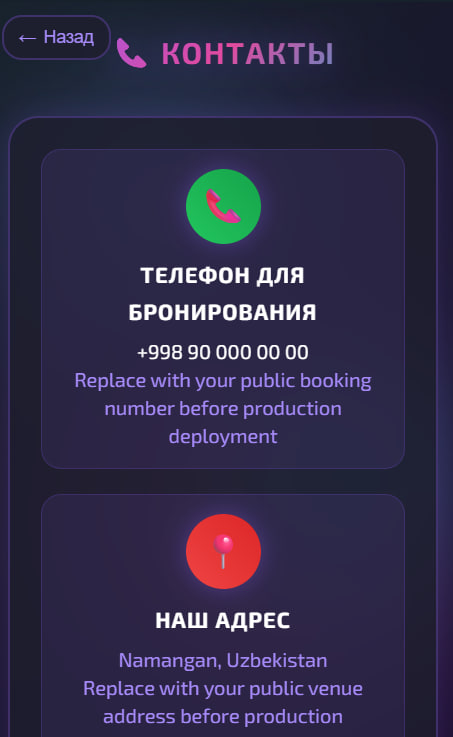</a>
      <br />
      <strong>About Screen</strong>
    </td>
    <td align="center" width="33%">
      <a href="screenshots/about-page-secondary.jpg">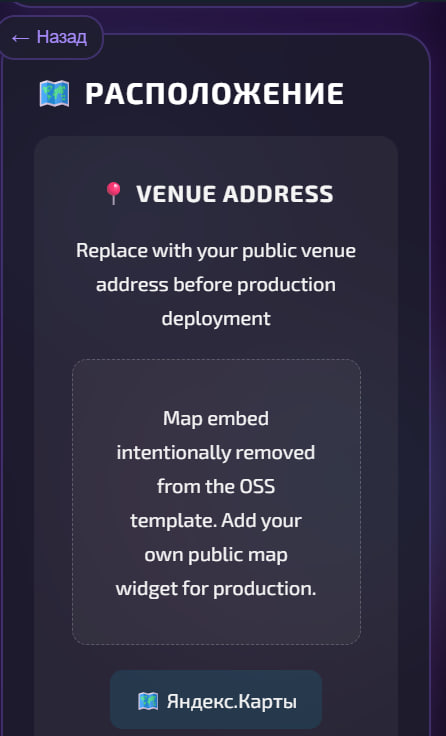</a>
      <br />
      <strong>About Secondary</strong>
    </td>
    <td align="center" width="33%">
      <a href="screenshots/about-page-social.jpg">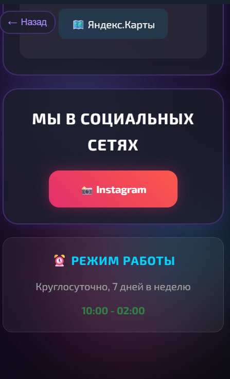</a>
      <br />
      <strong>Social / Contact View</strong>
    </td>
  </tr>
</table>

## License

Released under the MIT License. See [LICENSE](LICENSE).
